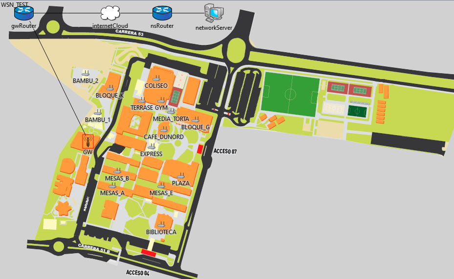

# WIRELESS SENSOR NETWORK UNINORTE

LoRaWAN simulation using `omnet++`.

# About

The purpose of this project is simulate a wireless network sensor within Uninorte's campus. Each node send data from from sensors, which monitor the crowd count within closed spaces. There are `15` nodes, one per each zone to monitor.

|  |
| :------------------------------: |
|         _Campus Network_         |

# Get Started

To start you need [Omnet++](https://omnetpp.org) , [Inet](https://inet.omnetpp.org/Download.html) and [Flora](https://flora.aalto.fi).

Once you have this, just link this project to inet and put the background image in your omnetpp images folder, then just run it.
